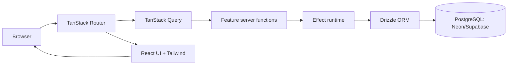

# Project Overview
This is a TanStack Start full-stack app running on Bun, using file-based routing,
TanStack Query for data access, Effect for typed workflows, and Drizzle ORM on
PostgreSQL. It targets Cloudflare Pages for deployment and uses Tailwind CSS v4
for styling with Better Auth integrated for authentication.

## Repository Structure
- AGENTS.md - Agent-facing project guide and conventions.
- biome.json - Biome linting and formatting configuration.
- components.json - Shadcn UI component generator configuration.
- Dockerfile - Container build configuration.
- drizzle.config.ts - Drizzle Kit configuration.
- entrypoint.sh - Container entrypoint script.
- package.json - Scripts, dependencies, and workspace metadata.
- README.md - Developer onboarding and general usage.
- tailwind.config.ts - Tailwind CSS configuration.
- tsconfig.json - TypeScript compiler configuration.
- vite.config.ts - Vite build and dev server configuration.
- wrangler.toml - Cloudflare Pages/Wrangler configuration.
- public/ - Static assets served directly by Vite/Cloudflare.
- src/ - Application source code (routes, features, DB, UI, and shared libs).
- src/components/ - Reusable UI components and layout primitives.
- src/drizzle/ - Database schema, migrations, and DB utilities.
- src/features/ - Feature modules with server functions, queries, and schemas.
- src/hooks/ - Shared React hooks for data and UI state.
- src/integrations/ - Integration glue (TanStack Query, external services).
- src/lib/ - Cross-cutting utilities, auth, query keys, and helpers.
- src/mail/ - Mail UI components and dialogs.
- src/routes/ - File-based routes and route groups for TanStack Router.
- src/scripts/ - One-off scripts and tooling helpers.
- src/types/ - Global type declarations.

## Build & Development Commands
Install dependencies:
```bash
bun install
```

Run the dev server:
```bash
bun --bun run dev
```

Build for production:
```bash
bun --bun run build
```

Preview production build locally:
```bash
bun --bun run serve
```

Deploy to Cloudflare:
```bash
bun --bun run deploy
```

Generate Cloudflare types:
```bash
bun --bun run cf-typegen
```

Run tests:
```bash
bun --bun run test
```

Lint and format:
```bash
bun --bun run lint
bun --bun run format
bun --bun run lint:fix
```

Type-check:
```bash
> TODO: add a type-check script (e.g. tsc --noEmit) if needed.
```

Database (Drizzle):
```bash
bun --bun run db:generate
bun --bun run db:migrate
bun --bun run db:push
bun --bun run db:studio
bun --bun run db:pull
bun --bun run db:export:sql
bun --bun run db:apply:sql
bun --bun run db:sync:data
bun --bun run db:migrate:sql
bun --bun run db:migrate:data
```

Debug:
```bash
> TODO: document a debug workflow (devtools, inspect flags, or IDE config).
```

## Code Style & Conventions
- Formatting uses Biome with tabs and double quotes.
- Prefer Effect Schema for validation; avoid introducing Zod for new code.
- Use TanStack Query `queryOptions` factories shared between loaders and hooks.
- Use `useSuspenseQuery` and route-level Suspense boundaries for loading states.
- Model async failures with Effect; avoid implicit `try/catch` control flow.
- Path aliases `#/*` and `@/*` resolve to [src/](src/).
- Commit message template: > TODO: define and enforce a commit message format.

## Architecture Notes


The app is structured around file-based routes in [src/routes/](src/routes/),
with loaders prefetching data via TanStack Query. Feature modules in
[src/features/](src/features/) encapsulate query definitions, schemas, and
server functions, which use Effect for typed async workflows. Drizzle manages
schema and migrations in [src/drizzle/](src/drizzle/), and the app deploys to
Cloudflare Pages via Wrangler.

## Testing Strategy
- Unit tests run with Vitest using `bun --bun run test`.
- Integration tests: > TODO: specify integration test tooling and locations.
- E2E tests: > TODO: define an E2E framework and CI command.
- CI: > TODO: document which commands are run in CI (test/lint/build).

## Security & Compliance
- Store local secrets in `.env.local`; never commit real credentials.
- Production secrets should be set with `wrangler secret put <VAR>`.
- Database URL resolution order is `DRIZZLE_DATABASE_URL` then
	`NEON_DATABASE_URL` then `DATABASE_URL`.
- Client-exposed environment variables must be prefixed with `VITE_`.
- Dependency scanning: > TODO: document any automated scans.
- License and third-party notices: > TODO: add if required.

## Agent Guardrails
- Always use `bun --bun` for runtime commands to avoid Node fallback.
- Do not reintroduce a light/auto theme; global theme is intentionally dark.
- Avoid adding `nitro` as a Vite plugin alongside `@cloudflare/vite-plugin`.
- Files never touched: > TODO: list any protected files or directories.
- Required reviews: > TODO: specify code ownership or review gates.
- Rate limits: > TODO: document API or service rate limit constraints.

## Extensibility Hooks
- Add routes by creating files in [src/routes/](src/routes/).
- Add new features as modules in [src/features/](src/features/).
- Register reusable hooks in [src/hooks/](src/hooks/).
- Extend auth behavior in [src/lib/auth.ts](src/lib/auth.ts).
- Environment variables are validated in [src/env.ts](src/env.ts).
- Feature flags: > TODO: document flags and toggles if present.

## Further Reading
- [README.md](README.md)
- [src/env.ts](src/env.ts)
- [src/routes/__root.tsx](src/routes/__root.tsx)
- [src/drizzle/schema.ts](src/drizzle/schema.ts)